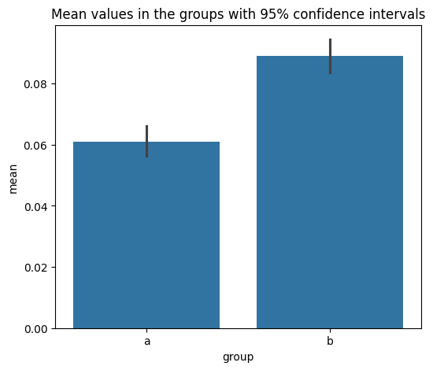
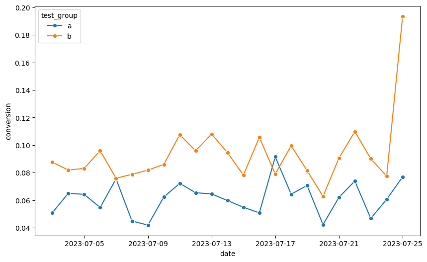

# A/B Testing: Pricing Strategy framing

## Project Overview
This project analyzes how "50% discount" framing affects subscription conversion rates compared to a standard $4.99 price display.

## Key Results
- **Group A (Control):** 6.1% conversion
- **Group B (Test):** 8.9% conversion
- **Statistical Significance:** p-value < 0.05 (Significant)

## Visualizations

### 1. Conversion Rate by Group (with 95% CI)
 
*The chart shows a clear uplift in Group B with non-overlapping confidence intervals.*

### 2. Conversion Dynamics over Time

*Daily conversion trends remain stable throughout the test period.*

## Conclusions
The test framing "50% discount" is highly effective. We recommend rolling out this change to 100% of the audience.
